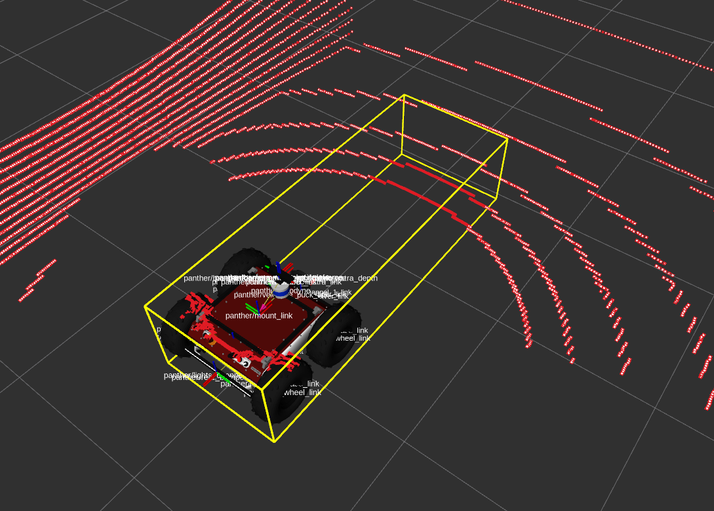
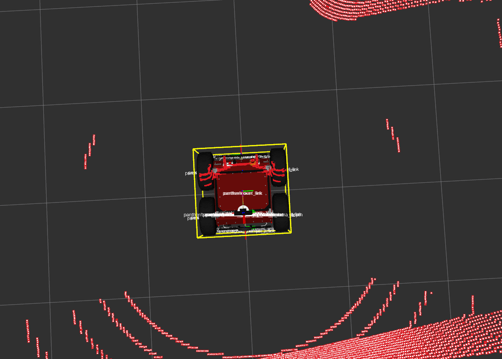
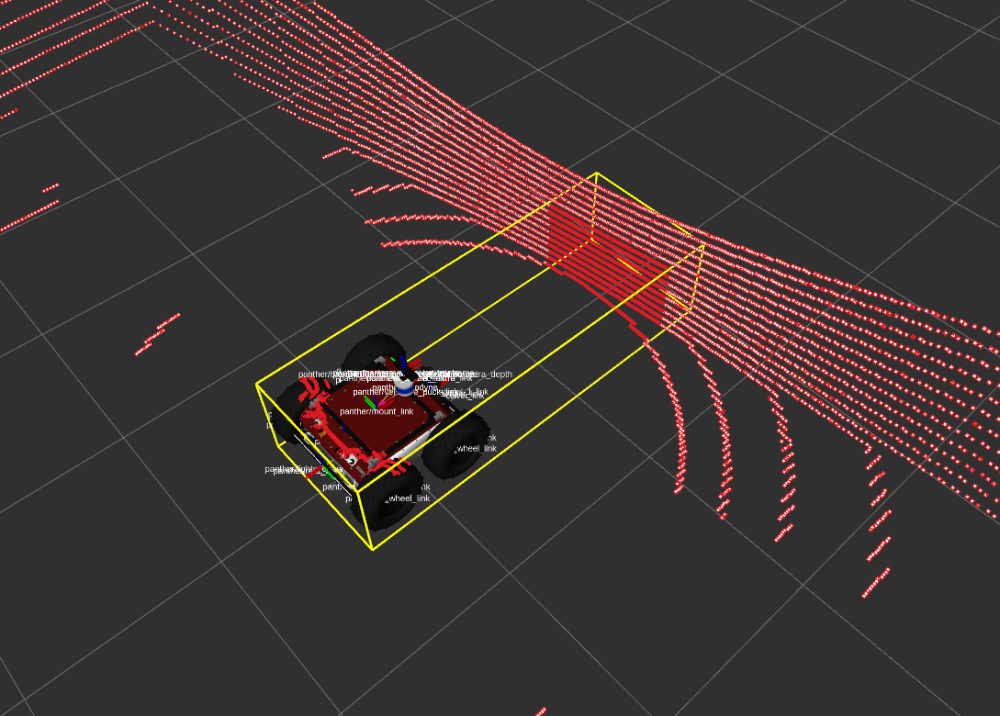

# pointcloud_crop_box

A ROS 2 package for filtering 3D point clouds using multiple axis-aligned cropping boxes.
It subscribes to a `sensor_msgs/msg/PointCloud2` or `sensor_msgs/msg/LaserScan`, transforms it into a target frame, filters it using configurable crop boxes, and publishes both the filtered cloud and visualization markers for the crop boxes.

<p float="center">
  
  
  
</p>


---

## Features

- Subscribes to raw point cloud data (e.g., from a LiDAR) or laser scan data
- Filters the cloud using multiple configurable 3D crop boxes
- Supports TF2 transformation to a target frame
- Option to invert the box filtering (i.e., remove inside instead of outside)
- Publishes the filtered cloud and visualization markers for the crop boxes

---

## ROS 2 Node

### `pointcloud_crop_box_node`

#### Subscribes

- **`<input_topic>`** (*sensor_msgs/msg/PointCloud2* or *sensor_msgs/msg/LaserScan*)
  Input topic containing raw data (default: `/points_raw`)

#### Publishes

- **`<output_topic>`** (*sensor_msgs/msg/PointCloud2*)
  Filtered point cloud after box cropping (default: `/points_filtered`)

- **`~/filter_crop_boxes`** (*visualization_msgs/msg/MarkerArray*)
  Visualization markers for all configured crop boxes, for visualization and debugging

---

## Parameters

- `input_topic` [*string*, default: **"/points_raw"**]: Topic to subscribe for input PointCloud2 data.
- `output_topic` [*string*, default: **"/points_filtered"**]: Topic to publish filtered PointCloud2 data.
- `target_frame` [*string*, default: **"base_link"**]: Target TF frame to transform the point cloud into.
- `crop_boxes_names` [*string_array*, default: **["robot_box"]**]: List of crop box names to apply sequentially.
- `crop_boxes` [*map*]: Configuration for multiple crop boxes, with each crop box having the following parameters:
  - `min_x` [*double*, default: **-1.0**]: Minimum X boundary of the crop box.
  - `max_x` [*double*, default: **1.0**]: Maximum X boundary of the crop box.
  - `min_y` [*double*, default: **-1.0**]: Minimum Y boundary of the crop box.
  - `max_y` [*double*, default: **1.0**]: Maximum Y boundary of the crop box.
  - `min_z` [*double*, default: **-1.0**]: Minimum Z boundary of the crop box.
  - `max_z` [*double*, default: **1.0**]: Maximum Z boundary of the crop box.
- `message_type` [*string*, default: **"pointcloud"**]: type of source data to crop, 'pointcloud' or 'laserscan'.
- `negative` [*bool*, default: **false**]: If true, keeps points **outside** the crop boxes instead of inside.
- `visualize_crop_boxes` [*bool*, default: **true**]: Whether to publish visualization markers for the crop boxes.

---

## Configuration

### Multiple Crop Boxes

This package supports multiple crop boxes that are applied sequentially to filter the point cloud. You can configure multiple crop boxes in the parameter file:

```yaml
/**:
  pointcloud_crop_box:
    ros__parameters:
      target_frame: base_link
      crop_boxes_names: ["robot_box", "robot_attachment_1", "robot_attachment_2"]
      crop_boxes:
        robot_box:
          min_x: -0.5
          max_x: 0.5
          min_y: -0.5
          max_y: 0.5
          min_z: -0.1
          max_z: 0.3
        robot_attachment_1:
          min_x: -2.0
          max_x: 2.0
          min_y: -1.0
          max_y: 1.0
          min_z: 0.5
          max_z: 2.0
        robot_attachment_2:
          min_x: -5.0
          max_x: 5.0
          min_y: -5.0
          max_y: 5.0
          min_z: 2.5
          max_z: 5.0
      negative: false
      message_type: pointcloud
      visualize_crop_boxes: true
```

---

## Example Launch

To show the result of the filtering you can follow our autonomy example in [husarion-ugv-autonomy](github.com/husarion/husarion-ugv-autonomy) to get  measurements of pointcloud.

## Build from Source

### Create Workspace

```bash
mkdir ~/husarion_ws
cd ~/husarion_ws
git clone https://github.com/husarion/pointcloud_crop_box.git src/pointcloud_crop_box
```

### Build

```bash
sudo rosdep init
rosdep update --rosdistro $ROS_DISTRO
rosdep install --from-paths src -y -i

source /opt/ros/$ROS_DISTRO/setup.bash
colcon build --symlink-install --packages-up-to pointcloud_crop_box --cmake-args -DCMAKE_BUILD_TYPE=Release
```

### Run configured launch:

```bash
source install/setup.bash
ros2 launch  pointcloud_crop_box pointcloud_crop_box_launch.py
```
